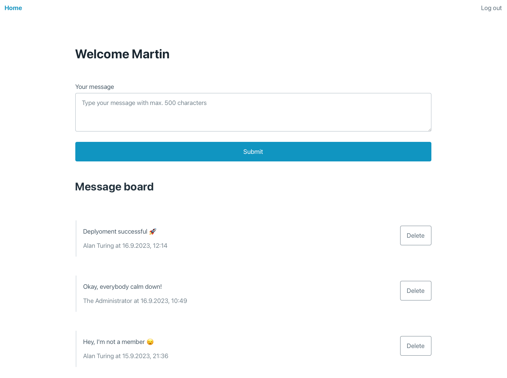

# Members-Only

<p align="center">
  
  <a href="https://github.com/insomniac2305/members-only/graphs/commit-activity" target="_blank"></a>
  
  <a href="https://github.com/insomniac2305/members-only/blob/master/LICENSE" target="_blank"></a>
</p>

## Overview

A private message board where only registered members can post messages, and administrators have additional privileges. This project was
built mainly with Express and MongoDB to practice setting up a full-stack application that includes user authentication.

<p align="center">
  
</p>

## Features

- 💬 Post and view messages
- 🔒 User authentication and authorization
- 🛑 Admin-only message deletion
- 🎨 Responsive and minimalist design

## Technologies Used

- Node.js & Express as backend
- MongoDB & Mongoose for data storage
- Passport.js & bcrypt for authentication
- Pug as templating engine
- Express-validator for input validation
- Pico CSS framework

## Setup Instructions

1. **Clone the repository:**
   ```sh
   git clone https://github.com/insomniac2305/members-only.git
   cd members-only
   ```
2. **Install dependencies:**
   ```sh
   npm install
   ```
3. **Set up environment variables:**
   Create a `.env` file and configure:
   ```env
   MONGODB_URI=<your_mongodb_uri>
   SESSION_SECRET=<your_secret_key>
   CLUB_SECRET=<your_club_secret>
   ```
4. **Start the server:**

   ```sh
   npm start
   ```

   For development with auto-restart:

   ```sh
   npm run devstart
   ```

5. **Access the application:**
   Open `http://localhost:3000` in your browser.

## License

This project is [GPL-3.0](https://github.com/insomniac2305/members-only/blob/master/LICENSE) licensed.
